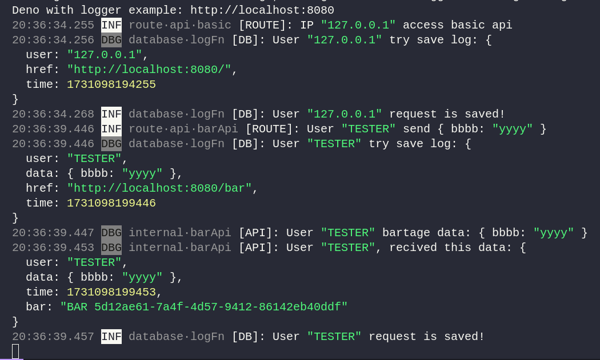
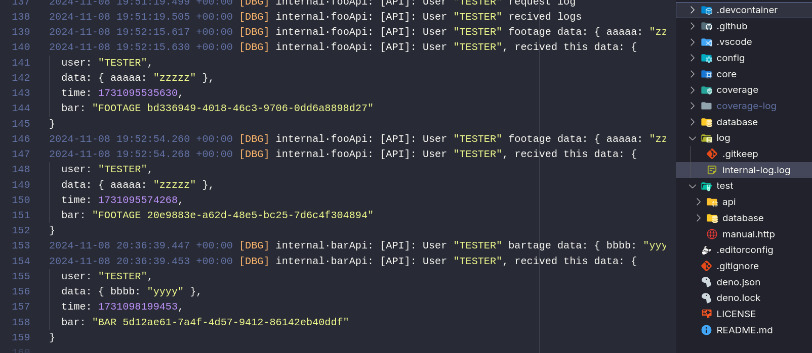
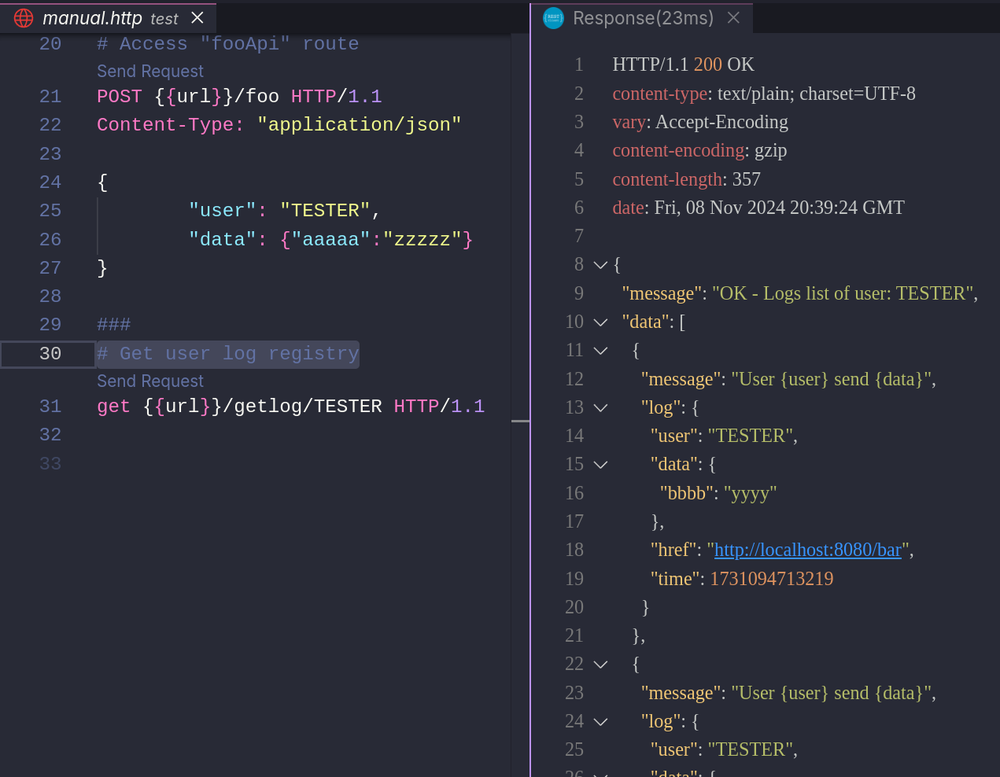
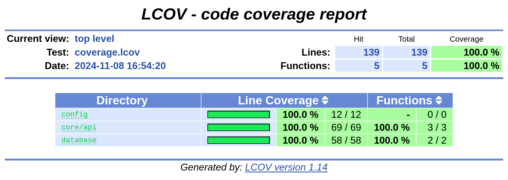

# Exemplo de implementação do LogTape em um CRUD Deno

Exemplo de implementação do sistema de logging "[LogTape](https://github.com/dahlia/logtape)" no contexto de uma API CRUD

## Resultados

#### Log em console

#### Log em arquivo local

#### Log salvo em banco de dados

## Ferramentas utilizadas

- Linguagem: [TypeScript](https://www.typescriptlang.org/)
- Runtimer: [Deno JS](https://deno.land/)
- Middleware: [Oak Server](https://github.com/oakserver/oak)
- Logger: [LogTape](https://github.com/dahlia/logtape)
- Tests: [Deno standard testing libraries](https://docs.deno.com/runtime/fundamentals/testing/#writing-tests)

## Testes / Cobertura

## Para uso/reprodução

#### Ambiente:

- [Docker Engine](https://docs.docker.com/engine/) (Para uso de containers)
- [VS Code](https://code.visualstudio.com/) (Para visualização/interação)
- [Extensão DevContainers](https://marketplace.visualstudio.com/items?itemName=ms-vscode-remote.remote-containers) (Para uso do container)

#### Uso:

- Abra as pasta do projeto no Dev Container
- Acione o comando `deno task dev` para iniciar a API

#### Testes:

- Acione o comando `deno task test` para visualizar os testes
- Para visualizar a cobertura, acione o comando `deno task coverage:report` e abra o arquivo `./coverage/index.html`
